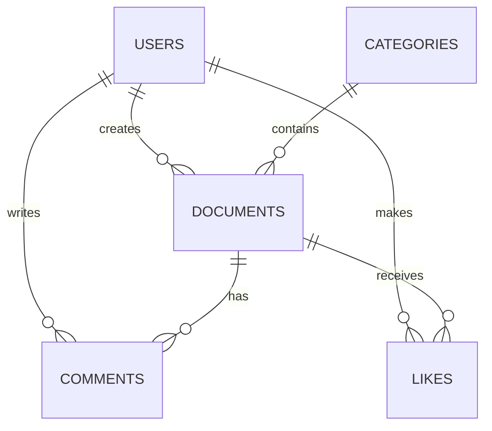

# 📚 Hệ thống Quản lý Tài liệu


## 📋 Tổng quan
> Hệ thống quản lý tài liệu là một ứng dụng web PHP hiện đại cho phép người dùng tải lên, chia sẻ và quản lý các tài liệu số một cách hiệu quả. Hệ thống được tích hợp đầy đủ các tính năng phân quyền, quản lý danh mục, tương tác và bảo mật.

### 🌟 Tính năng nổi bật
- ✨ Giao diện người dùng thân thiện, dễ sử dụng
- 🔒 Hệ thống phân quyền chi tiết
- 📁 Quản lý tài liệu với nhiều định dạng
- 🔍 Tìm kiếm và lọc tài liệu nâng cao
- 📊 Thống kê và báo cáo chi tiết

## 🚀 Chức năng chính

### 👥 1. Quản lý người dùng
- 📝 Đăng ký tài khoản mới
- 🔑 Đăng nhập/đăng xuất an toàn
- 👑 Phân quyền người dùng (Admin/User)
- 👤 Quản lý thông tin cá nhân
- 📱 Theo dõi hoạt động người dùng
- 🔄 Khôi phục mật khẩu qua email

### 📑 2. Quản lý tài liệu
- ⬆️ Upload tài liệu đa định dạng
  - PDF
  - DOC/DOCX
  - XLS/XLSX
- 📂 Phân loại tài liệu theo danh mục
- 🔍 Tìm kiếm và lọc tài liệu
- ✅ Kiểm duyệt nội dung
- 📈 Thống kê lượt xem/tải
- 🔐 Quản lý quyền riêng tư

### 💬 3. Tương tác người dùng
- 💭 Bình luận trên tài liệu
- ❤️ Like/Unlike tài liệu
- 🔔 Nhận thông báo tương tác
- 📧 Gửi tin nhắn liên hệ

### ⚙️ 4. Quản trị hệ thống
- 📁 Quản lý danh mục
- 👥 Quản lý người dùng
- ⚙️ Cấu hình hệ thống
- 💾 Sao lưu/khôi phục dữ liệu
- 📊 Báo cáo thống kê

## 💽 Cấu trúc Database

### 📊 Sơ đồ quan hệ


## 🛠️ Yêu cầu hệ thống

| Thành phần | Phiên bản tối thiểu |
|------------|---------------------|
| PHP        | 7.4+                |
| MySQL      | 8.0+                |
| Web Server | Apache/Nginx        |
| Extensions | PDO, GD, ZIP        |
| Composer   | 2.0+                |

## 📥 Cài đặt


```

2. Cài đặt dependencies
```bash
composer install
```

3. Cấu hình database
```bash
# Import schema
mysql -u username -p database_name < database/dbsql.sql

# Cấu hình kết nối
cp config/config.example.php config/config.php
# Chỉnh sửa thông tin trong config.php
```

4. Cấu hình thư mục
```bash
# Tạo thư mục uploads
mkdir uploads
chmod -R 777 uploads/

# Tạo tài khoản admin
php create_admin.php
```

## 🔒 Bảo mật

- 🔑 Mã hóa mật khẩu với password_hash()
- 🛡️ Xác thực phiên đăng nhập
- 🔐 Kiểm soát phân quyền
- 🛑 Chống SQL Injection
- 🔍 Kiểm tra dữ liệu đầu vào
- 📝 Ghi log hoạt động

## 📖 Tài liệu

- [Hướng dẫn sử dụng](docs/user-guide.md)
- [Tài liệu API](docs/api-docs.md)
- [Hướng dẫn đóng góp](CONTRIBUTING.md)
